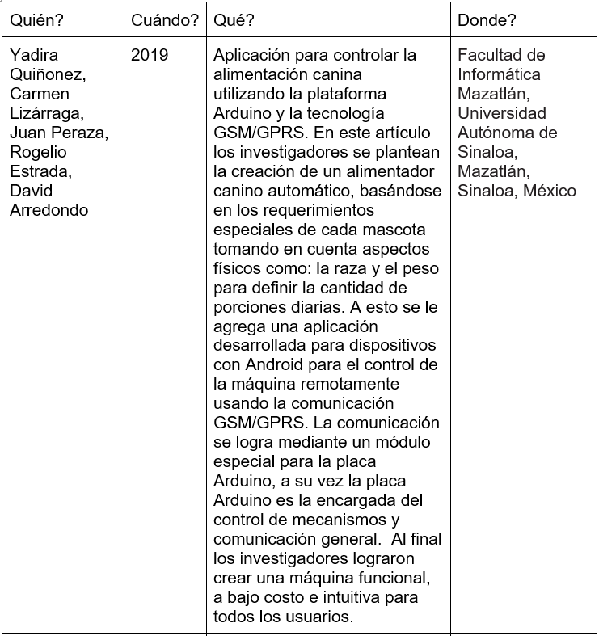
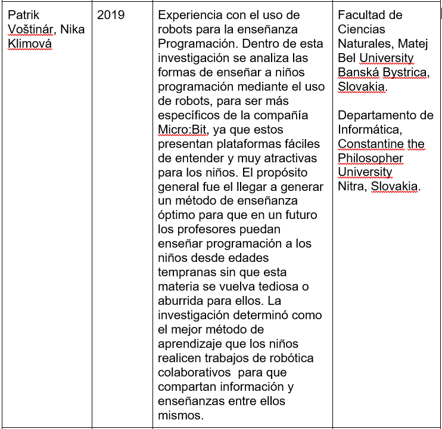
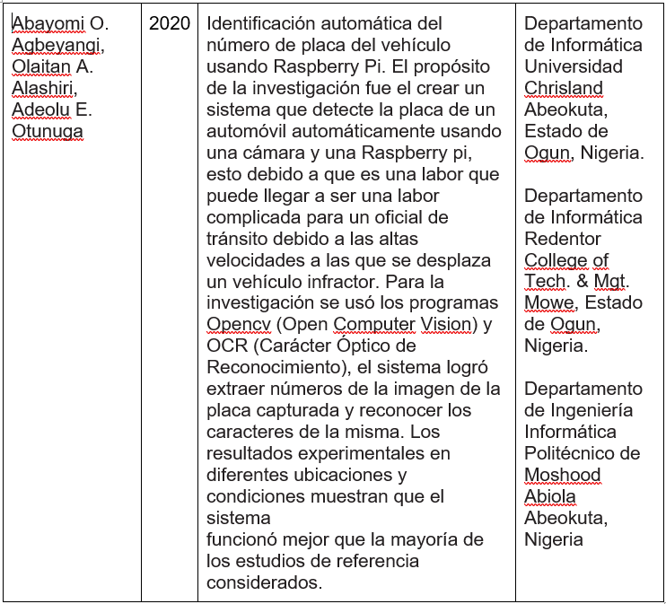

# Arduino, Micro Bit y Raspberry Pi

## 1. Planteamineto del problema

## 2. Objetivos
   - **General**
     - Analizar los componentes, características y plataformas de desarrollo básicas para los dispositivos Arduino, Micro:Bit y Raspberry Pi
   - **Específicos**
     - Identificar los componentes principales de cada dispositivo y determinar sus funciones.
     - Explorar los entornos de desarrollo básicos existentes para cada dispositivo.
     - Explorar los entornos de desarrollo básicos existentes para cada dispositivo.
## 3. Estado del Arte

En lo que respecta a nuestro Producto de Unidad cada una de estas investigaciones tienen su aportación pero estas deberán ser analizadas desde 3 perspectivas distintas

 - Respecto al uso del Arduino en un alimentador canino, nosotros asociamos al producto de unidad él cómo podemos facilitar nuestras actividades diarias con el uso de una simple placa electrónica y la creación de un algoritmo. Esto nos abre más posibilidades en usos facilitandonos las actividades diarias.
 - El micro:bit dentro de nuestro producto de unidad está directamente relacionado en el aprendizaje sobretodo en lo que es programación ya que al ser una plataforma fácil de entender será fácil de usar tanto en niños como en jóvenes como nosotros que estamos empezando a desarrollar habilidades dentro del campo de la informática.
 - En relación del raspberry podemos considerar el uso que se le da con respecto a la computación y al internet de las cosas ya que podemos reducir costos en equipos y espacio con el uso de este pequeño dispositivo ampliando nuestra gama de posibilidades y beneficios.
## 4. Marco Teórico
### Arduino
#### ¿Que es Arduino?
Cuando hablamos de Arduino, hablamos de 3 apartados distintos:
- Una placa de hardware libre: Al hablar de Arduino físicamente hablamos de una placa electrónica multipropósito de libre modificación por parte de sus usuarios, la cual tendrá distintos componentes conectados entre sí. Algunos de sus componentes son cristales, resistencias, capacitores, pines de conexión, etc. Pero el más importante de sus componentes es el microcontrolador, el cual se encargará de realizar los distintos cálculos y de procesar la información recibida para enviar respuestas dependiendo de cómo lo hayamos programado.  Al hablar de hardware libre queremos decir que su modelo o diagramas están abiertas a modificaciones por parte de los usuarios. Arduino a su vez es una placa de Hardware ya que posee componentes electrónicos conectados entre sí. Todos sus componentes electrónicos son controlados mediante un microcontrolador, en Arduino encontraremos los microcontroladores de la familia AVR. (Torrente, 2013)
- Un Software o Entorno de desarrollo libre: Arduino es también el programa que instalamos en nuestra computadora (Windows, MacOS y Linux) donde podemos desarrollar, compilar y cargar nuestro código. (Torrente, 2013)
- Un lenguaje de programación libre: Por ‘’Lenguaje de programación ‘’ nos referimos a un lenguaje artificial diseñado para dar instrucciones a una máquina. Arduino tiene un lenguaje de programación similar a otros lenguajes respecto a sus bloques de control y flujo, pero su sintaxis es mucho más amigable para realizar proyectos de electrónica. (Torrente, 2013)
#### Componentes de un Arduino
Arduino tiene una inmensa gama de modelos lo que hace que definir todos los componentes sea complicado, por lo cual describiremos los componentes existentes en todos los modelos de manera general:

1. **Jack de Potencia**
