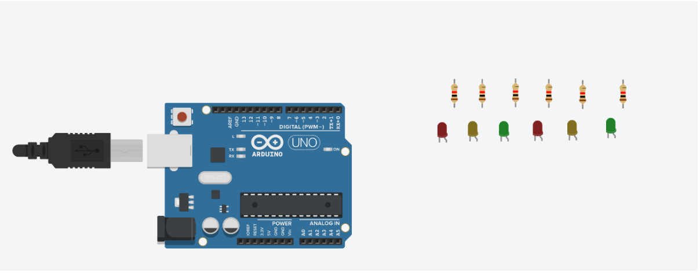

# Arduino, Micro Bit y Raspberry Pi

## 1. Planteamineto del problema
Identificar componentes de las 3 diferentes placas planteadas, Explicar mediante ejemplos respectivos para cada placa, su funcionamiento ademas de el software necesario para poder programar cada aplicacion.
## 2. Objetivos
   - **General**
     - Analizar los componentes, características y plataformas de desarrollo básicas para los dispositivos Arduino, Micro:Bit y Raspberry Pi
   - **Específicos**
     - Identificar los componentes principales de cada dispositivo y determinar sus funciones.
     - Explorar los entornos de desarrollo básicos existentes para cada dispositivo.
     - Explorar los entornos de desarrollo básicos existentes para cada dispositivo.
## 3. Estado del Arte


En lo que respecta a nuestro Producto de Unidad cada una de estas investigaciones tienen su aportación pero estas deberán ser analizadas desde 3 perspectivas distintas

 - Respecto al uso del Arduino en un alimentador canino, nosotros asociamos al producto de unidad él cómo podemos facilitar nuestras actividades diarias con el uso de una simple placa electrónica y la creación de un algoritmo. Esto nos abre más posibilidades en usos facilitandonos las actividades diarias.
 - El micro:bit dentro de nuestro producto de unidad está directamente relacionado en el aprendizaje sobretodo en lo que es programación ya que al ser una plataforma fácil de entender será fácil de usar tanto en niños como en jóvenes como nosotros que estamos empezando a desarrollar habilidades dentro del campo de la informática.
 - En relación del raspberry podemos considerar el uso que se le da con respecto a la computación y al internet de las cosas ya que podemos reducir costos en equipos y espacio con el uso de este pequeño dispositivo ampliando nuestra gama de posibilidades y beneficios.
## 4. Marco Teórico
### Arduino
#### ¿Que es Arduino?
Cuando hablamos de Arduino, hablamos de 3 apartados distintos:
- Una placa de hardware libre: Al hablar de Arduino físicamente hablamos de una placa electrónica multipropósito de libre modificación por parte de sus usuarios, la cual tendrá distintos componentes conectados entre sí. Algunos de sus componentes son cristales, resistencias, capacitores, pines de conexión, etc. Pero el más importante de sus componentes es el microcontrolador, el cual se encargará de realizar los distintos cálculos y de procesar la información recibida para enviar respuestas dependiendo de cómo lo hayamos programado.  Al hablar de hardware libre queremos decir que su modelo o diagramas están abiertas a modificaciones por parte de los usuarios. Arduino a su vez es una placa de Hardware ya que posee componentes electrónicos conectados entre sí. Todos sus componentes electrónicos son controlados mediante un microcontrolador, en Arduino encontraremos los microcontroladores de la familia AVR. (Torrente, 2013)
- Un Software o Entorno de desarrollo libre: Arduino es también el programa que instalamos en nuestra computadora (Windows, MacOS y Linux) donde podemos desarrollar, compilar y cargar nuestro código. (Torrente, 2013)
- Un lenguaje de programación libre: Por ‘’Lenguaje de programación ‘’ nos referimos a un lenguaje artificial diseñado para dar instrucciones a una máquina. Arduino tiene un lenguaje de programación similar a otros lenguajes respecto a sus bloques de control y flujo, pero su sintaxis es mucho más amigable para realizar proyectos de electrónica. (Torrente, 2013)
#### Componentes de un Arduino
Arduino tiene una inmensa gama de modelos lo que hace que definir todos los componentes sea complicado, por lo cual describiremos los componentes existentes en todos los modelos de manera general:


**1. Jack de Potencia:**
Algunos modelos de Arduino cuentan con un Jack de alimentación que nos permite conectar una fuente de alimentación de forma directa, comúnmente este Jack viene en los modelos grandes o más completos.

**2. Conector de comunicación tipo USB:**
Este componente nos permitirá la conexión con el ordenador y también la alimentación del Arduino. Cabe aclarar que existen diferentes tipos de conectores USB por lo que cada modelo de Arduino contará con su propio conector, inclusive algunos modelos de Arduino no lo incluyen, en su mayoría los modelos que no incluyen un conector serial son los modelos pequeños.

**3. Pin Vin:**
Con este pin podemos alimentar nuestro Arduino sin la necesidad de alimentarlo mediante el Jack de potencia o el Conector USB. Este pin viene en todos los modelos de Arduino ya que en modelos pequeños no dispondremos de Jack de potencia o conector USB.

**4. Pin de 5V:**
Este pin nos permite alimentar otros componentes electrónicos que no necesiten de una gran potencia como lo serían algunos sensores. Este pin tiene la finalidad de evitarnos el cableado de alimentación de componentes que estén cerca del Arduino y que trabajan con potencias bajas.

**5. Pin de 3.3V:**
Al igual que el pin de 5V, este pin nos permite alimentar componentes que trabajan con voltajes de referencia bajos evitándose usar fuentes alternas de alimentación.

**6. Pin de GND:**
El pin de GND (Tierra) es común en todos los circuitos electrónicos de corriente continua y nos permite conectar el mismo a otros componentes externos o en caso de usar el pin de alimentación Vin debemos conectar este pin directo al GND de nuestra fuente de alimentación.

**7. Pines Analógicos:**
La placa Arduino puede leer valores de voltaje analógicos siempre y cuando estos no superen los 5V ya que valores superiores de voltaje podrían dañar nuestra placa. Con voltajes analógicos nos referimos a valores de voltaje que no son constantes con respecto al tiempo, es decir valores variables de voltaje. Cabe aclarar que Arduino es capaz únicamente de leer valores de voltaje analógicos, pero no es capaz de enviar señales analógicas. Estos pines están representados en la placa por la letra A.

**8. Pines Digitales:**
Al trabajar con electrónica digital estamos hablando de enviar valores de voltaje de 0V o 5V (0 y 1 lógico). Estos pines pueden ser de entrada y salida es decir pueden enviar y recibir señales digitales. Estos pines van numerados del 0 hasta n, donde n dependerá del modelo de Arduino usado. Los pines de entrada analógica también pueden ser usados como pines digitales.

**9. Pines PWM:**
Primero debemos aclarar que es una señal PWM. Esta es una señal de tipo digital sus siglas traducidas del inglés significan Modulación por Ancho de Pulso (Pulse Width Modulation) una señal digital posee 2 estados lógicos (0 o 1) si en un intervalo de tiempo dado nosotros hacemos que nuestro circuito envié ambas señales de manera repetitiva y constante ya estamos generando una onda cuadrada la cual será una señal PWM. Las aplicaciones de una señal PWM son el envió de información y modificar la cantidad de energía que se envía a una carga.
Con respecto al modificar la cantidad de energía que se envía a una carga esta aplicación de una señal PWM es muy útil cuando trabajamos con leds o motores ya que podemos modificar su intensidad sin necesidad de trabajar con señales analógicas. Esto lo podemos realizar mediante la modificación de sus ciclos de trabajo.


El ciclo de trabajo en una señal PWM se determina en función de la siguiente fórmula:


Donde Ta es el Tiempo en estado alto, T es el periodo de la señal y C es el ciclo de trabajo.
Si a un Led le enviamos una señal PWM con un ciclo de trabajo del %50 su intensidad será del %50 respecto a su máxima, mientras que si enviamos una señal con un ciclo de %0 el diodo estará apagado.
En Arduino tenemos pines que permiten enviar señales de este tipo y están identificados con el siguiente símbolo en su placa ~.

**10.Pin Aref:**
Este pin nos permite tomar valores de voltaje de referencia para sensores analógicos que envíen valores al Arduino mayor a su rango de bit siempre y cuando estén en el rango de 0v a 5v.

**11.Botón Reset, Pin Reset:**
Este botón y pin nos permiten reiniciar nuestro código desde el principio tanto en funciones como en valores es decir vuelve a iniciar el código sin información guardada y comenzando desde su primera línea de código.

**12. LED de alimentación:**
Son 2 leds que nos indican cuando se está transmitiendo información (TX) y recibiendo información (RX) por medio de su puerto de comunicación serial.

**13.Indicador RX y TX:**
Este componente nos permite regular la alimentación que reciba nuestro Arduino de la fuente par que el Arduino tenga 5V limpios de alimentación.

**14.Regulador de Voltaje:**
Este circuito integrado es el encargado de la comunicación en si ya que por medio de este componente pasan todos los datos que enviemos o recibamos del ordenador y los dirige al microcontrolador de nuestro Arduino.

**15.Circuito de comunicación:**
Este componente es el encargado de generar los pulsos de reloj de nuestro Arduino los cuales genera la velocidad de procesamiento.

**16.Cristal:**
Este conector nos permite recibir nuestro código sin necesidad de usar la comunicación USB pero para esto es necesario el uso de programadoras externas.

**17.Conector ICSP:**
Es un led indicador de que nuestro Arduino se encuentra alimentado y operando.

**18.Microcontrolador:**
Este es cerebro de nuestro Arduino el encargado de procesar datos e instrucciones. Este cuenta con:
  - Memoria: SRAM, Flash, EEPROM, ROM, etc.
  - Buses
  - UART
  - Otras comunicaciones.
  - CPU
En otras palabras el microcontrolador es el Arduino ya que los pines del Arduino son jacks que facilitan la conexión con los pines del microcontrolador.
Arduino usa la gama de microcontroladores AVR de Atmel pertenecientes a la familia de microcontroladores RISC. Cada microcontrolador posee diferentes características: tamaños, RAM, ROM, etc. El microcontrolador usado dependerá exclusivamente del modelo de Arduino.

#### Componentes Arduino Uno
Para el modelo Arduino UNO contaremos con los siguientes componentes
 - El microprocesador ATmega328
 - 32 kbytes de memoria Flash (Memoria donde se guardará nuestro programas y datos permanentes)
 - 1 kbyte de memoria RAM (Memoria Temporal o de Datos Volátiles)
 - 16 MHz (Velocidad de trabajo del microcontrolador)
 - 14 pins para entradas/salidas digitales (programables)
 - 5 pins para entradas analógicas (Pueden ser usadas como digitales)
 - 6 pins para salidas analógicas (salidas PWM)
 - Microcontrolador ATmega328
 - Voltaje de operación 5V
 - Voltaje de entrada (recomendado) 7-12 V
 - Voltaje de entrada (limite) 6-20 V
 - DC corriente I/O Pin 40 mA
 - DC corriente 3.3V Pin 50 mA
 - EEPROM 512 bytes (Memoria ROM borrable eléctricamente)
 
#### TinkerCAD
**¿Qué es CAD?**

Cuando hablamos de CAD nos referimos al diseño asistido por computadora traducido de sus siglas en inglés computer-aided design.

**¿Qué es TinkerCAD?**

TinkerCAD es un software desarrollado por AutoDesk para la creación de modelos 3D basado en geometría sólida constructiva (CSG), este software tiene la particularidad que no es necesario ser un gran experto en diseño 3D ya que inclusive niños pueden crear sus modelos a manera de aprendizaje.

**¿Cómo se relaciona TinkerCAD con Arduino?**

TinkerCad tiene un emulador de circuitos electrónicos que viene incluido con un Arduino UNO para emular, incluido un editor de código de Arduino con algunas librerías y un depurador.
Todas estas características hacen que no se no haga tan complicado crear programas y circuitos dentro de este entorno ya que el software es sumamente intuitivo y sencillo de usar. 
Entorno


En la parte derecha contamos con un menú desplegable con distintos componentes electrónicos que nos facilita el software. En la parte izquierda se muestra un recuadro con distintos tutoriales en caso de no tener conocimientos básicos en simuladores de circuitos electrónicos.
En el menú superior contamos con distintos botones funcionales como lo son: el inicio de simulación, depurador, editor de códigos e inclusive contamos con la opción de compartir.
El principio de simulación es sencillo ya que únicamente debemos establecer puntos de conexión mediante las líneas que creamos.

#### Editor de código TinkerCAD
El funcionamiento de este editor de código es similar al software propio de Arduino en caso de que decidamos trabajar con texto ya que su sintaxis de programación es la misma. TinkerCAD cuenta con un generador de códigos mediante bloques el funcionamiento de este es más intuitivo ya que nos evitamos el escribir muchas líneas de código ya que al ser una herramienta visual es más sencillo. El software también nos permite crear un código mezclando bloques y texto.


Ejemplos realizados (revisar el resto de documento para conocer programación y diagramas):
 - Simulación de semáforo
 - Simulación de barrido de diodos
### MicroBit
En el caso específico del microbit necesitamos saber, que es, cuáles son sus características, que tipo de proyectos podemos realizar con él, cuál es su manera de operar. Debemos indagar todos esos aspectos debido a que no se conoce nada sobre la placa en la que se va a trabajar.
**¿Qué es MicroBit?**

MicroBit es una tarjeta de circuitos del tamaño de la palma de una mano con una serie de 25 ledes y un chip Bluetooth para conexión inalámbrica. Puede ser programada para mostrar letras, números y otros símbolos y caracteres.
Micro Bit fue diseñada para alentar a los niños a participar activamente en la creación de software para computadoras y la creación de nuevas cosas, en lugar de ser consumidores de medios. Creada para funcionar junto con otros sistemas, como Raspberry Pi

**¿Cuáles son las características de MicroBit?**
 - Incluye dos botones, un acelerómetro y una brújula, y unos anillos a los cuales pueden ser conectados otros sensores.
 - En lugar de introducir el código directamente en la computadora, los usuarios deben escribirlo en una elección de cuatro lenguajes de programación basados en una PC, o en una tableta o teléfono inteligente, a través de una aplicación.
 - Después deben transferir los códigos a Micro Bit, que funciona como un dispositivo independiente que puede ser usado para proyectar mensajes y registrar movimientos, entre otras tareas.
 - También puede agregarse a otros dispositivos para formar el “cerebro” de un robot o desarrollar un instrumento musical.
 - Una nueva función posibilita las comunicaciones entre esas máquinas, lo cual significa que una Micro Bit pueda transmitir información a otra, abriendo un nuevo espectro de posibilidades.

**Componentes de MicroBit**
 - **Leds:**
 Microbit dispone de 25 LEDs programables individualmente que te permiten mostrar texto, números e imágenes.
 
 
 
 - **Botones:**
 Hay dos botones en la cara frontal de micro:bit (etiquetados como A y B). Puedes detectar cuándo son pulsados de forma independiente o a la vez y ejecutar una acción en cada caso.
 
 
 
 - **Pines de entrada y salida:**
 Microbit es ampliable hasta donde imagines. Dispone de 25 conectores situados en el borde inferior . A través de ellos podrás programar motores, LEDs o cualquier otro componente o sensor externo que conectes de Arduino o similares.
 
 
 
 - **Sensor de luz:**
 Los LEDs de la placa micro:bit también pueden actuar como entrada haciendo que detecten la luz ambiente.
 
 
 
 - **Sensor de temperatura:**
 El sensor de temperatura integrado en la placa detecta la temperatura ambiente en grados Celsius.
 
  
 
 - **Acelerómetro:**
El acelerómetro mide la aceleración de tu micro:bit. Se activa cuando tu placa se mueve y también puede detectar otras acciones como agitar, girar y hasta soltar tu micro:bit en caída libre!


- **Brujula:**
La brújula detecta el campo magnético terrestre por lo que puedes saber en qué dirección está orientada tu micro:bit. (Necesita ser calibrada para asegurar un resultado preciso.)


- **Radio:**
La radio te permite comunicar tu micro:bit con otras micro:bit. Por ejemplo, puedes conectar todas las tarjetas dentro de un aula a una misma emisora, usarla para enviar mensajes entre ellas y mucho más!.


- **Bluetooth:**
El BLE (Bluetooth Low Energy) permite a micro:bit enviar y recibir datos vía bluetooth para comunicarse de forma inalámbrica con PCs, Teléfonos y Tablets.


- **USB y conector para batería externa:**
La placa micro:bit puede alimentarse a través del puerto USB. También dispone de un conector específico para 2 pilas AAA o una batería.
Al igual que en Arduino, esta placa almacena en su memoria un único programa que se ejecuta en cuanto recibe alimentación (ya que carece de un conmutador de encendido y apagado).


#### Plataforma de trabajo de MicroBit
Esta pequeña tarjeta va de la mano con la pagina creada por sus desarrolladores, ya que están podemos encontrar herramientas de programación debido a que esta tarjeta tiene un entorno de programación gráfico propio la pagina posee el apartado MakeCode de Microsoft, un sencillo editor gráfico online muy potente y gratuito que posibilita introducirnos en el mundo de la programación de forma intuitiva a través del lenguaje de programación visual o de bloques. Con él aprendemos a pensar como un programador sin caer en los molestos errores de sintaxis. MakeCode es, sin duda, una herramienta a tener muy en cuenta por nuestros profesores.
BBC MicroBit también se puede programar con JavaScript, Pyton y Scratch (añadiendo una extensión).


### Raspberry Pi
#### ¿Que es un Raspberry y para qué sirve?
Raspberry Pi, es un «es un ordenador de tamaño de tarjeta de crédito que se conecta a su televisor y un teclado». Es una placa que soporta varios componentes necesarios en un ordenador común.«Es un pequeño ordenador capaz, que puede ser utilizado por muchas de las cosas que su PC de escritorio hace, como hojas de cálculo, procesadores de texto y juegos. También reproduce vídeo de alta definición», apuntan en la página web del producto.
Este proyecto fue ideado en 2006 pero no fue lanzado al mercado febrero de 2012. Ha sido desarrollado por un grupo de la Universidad de Cambridge y su misión es fomentar la enseñanza de las ciencias de la computación los niños. De hecho, en enero de este año Google donó más de 15.000 Raspberry Pi para colegios en Reino Unido.
Es un ordenador muy funcional y debido a su tamaño puede funcionar para muchos otros propósito, claro, hay que tener algunas ideas sobre programación o de computación. Por ejemplo, el primer proyecto de un joven con Raspberry Pi fue convertir su consola NES dañada en una operativa y pudo jugar algunos viejos títulos.
#### Componentes del Raspberry Pi 4
 - Características de la Raspberry Pi 4 Broadcom BCM2711, Cortex núcleo cuádruple-A72 (ARM v8) 64-bit SoC @ 1.5GHz
 - SDRAM LPDDR4-2400 de 1 GB, 2 GB, 4 GB y 8 GB (según el modelo)
 - 2,4 GHz y 5,0 GHz IEEE 802.11ac inalámbrico, Bluetooth 5.0, BLE
 - Gigabit Ethernet 2 puertos USB 3.0; 2 puertos USB 2.0.
 - Cabezal GPIO estándar de 40 pines de Raspberry Pi (totalmente compatible con las placas anteriores)
 - 2 × puertos micro-HDMI (soportados hasta 4kp60)
 - Puerto de pantalla MIPI DSI de 2 vías
 - Puerto de cámara MIPI CSI de 2 carriles
 - Puerto de audio estéreo de 4 polos y de vídeo compuesto H.265 (decodificación 4kp60)
 - H264 (decodificación 1080p60, decodificación 1080p30)
 - Gráficos OpenGL ES 3.0
 - Ranura para tarjetas Micro-SD para cargar el sistema operativo y el almacenamiento de datos
 - 5V DC a través de conector USB-C (mínimo 3A*)
 - 5V DC vía cabezal GPIO (mínimo 3A*)
 - Alimentación a través de Ethernet (PoE) habilitada (requiere PoE HAT separado)
 - Temperatura de funcionamiento: 0 – 50 grados C ambiente
 #### El procesador
 El procesador encapsulado, que utiliza el mismo dispersor de calor para un mejor control térmico que el modelo anterior, puede tener el mismo aspecto desde el exterior. Pero mientras que el modelo de la Raspberry Pi 3 se construyó en torno al procesador Broadcom BCM2837, un ARM Cortex-A53 de cuatro núcleos a 1,4 GHz, la nueva placa se ha construido en torno al Broadcom BCM2711, un ARM Cortex-A72 de cuatro núcleos a 64 bits a 1,5 GHz. Aunque esto no parezca significativo, hay algunas grandes diferencias entre las arquitecturas centrales de estos dos procesadores. 
Mientras que el A53 fue diseñado como un núcleo de rango medio, y para la eficiencia, el A72 es un núcleo de rendimiento, así que a pesar de la aparentemente pequeña diferencia en la velocidad del reloj, la diferencia de rendimiento real entre los núcleos es realmente significativa.
#### USB y Ethernet
La diferencia más notable con respecto a los modelos anteriores es que el Microchip LAN7515, que actuaba como hub USB y como controlador Ethernet para la Pi, no aparece en la nueva placa. En su lugar se encuentra el VLI VL805, que proporciona un concentrador USB 3.0 a través de un bus PCI Express. 
El uso del bus PCI Express proporcionado por el nuevo BCM2711 significa que no sólo ahora tenemos capacidad USB 3.0, sino que el Gigabit Ethernet que se proporcionaba anteriormente a través del bus USB y el chip LAN7515 -que tenía un rendimiento máximo limitado a unos 300Mbps- ahora se proporciona utilizando el Broadcom BCM54213PE en un bus separado para el tráfico USB. 
Esto significa que, en lugar de ser estrangulado como vimos con el modelo B+ de Raspberry Pi 3, la nueva Raspberry Pi 4 tiene una Gigabit Ethernet “real”. 
La nueva placa Raspberry Pi tiene tanto Gigabit Ethernet “real” como dos puertos USB 3.0, así como un par de puertos USB 2 más.
#### Soporte Inalámbrico
El mismo chip Cypress CYW43455 que vimos en Raspberry Pi 3, modelo B+, proporciona soporte inalámbrico en un módulo apantallado por RF. Ofrece redes inalámbricas IEEE 802.11.b/g/n/ac de banda dual de 2.4GHz y 5GHz, así como Bluetooth 5.0 y Bluetooth LE.
#### La Memoria
Para completar todo está la LPDDR4 SDRAM para la placa, que viene en forma de un chip empaquetado en Micron FBGA, y aquí es donde aparece otra gran diferencia con respecto a los modelos anteriores de Raspberry Pi. A diferencia de cualquier placa anterior, la nueva Raspberry Pi 4 está disponible en tres modelos diferentes, cada uno de los cuales ofrece diferentes opciones de memoria. La nueva placa puede venir con 1 GB, 2 GB o 4 GB de RAM.
#### Alimentación de la placa
Otra gran diferencia es la toma de corriente, que se ha ido es la toma micro-USB de los modelos anteriores, y en su lugar hay una toma USB-C. Es un cambio comprensible. Las tolerancias en la fuente de alimentación para el modelo B+ de Raspberry Pi 3 ya eran bastante finas, y la nueva placa puede requerir hasta 3 amperios, eso no es algo que la anterior fuente micro-USB pudiera proporcionar. La placa también puede alimentarse a través de una fuente de alimentación de 5V DC utilizando los cabezales GPIO, y al igual que la Raspberry Pi 3, modelo B+, antes de que lo haga la nueva Raspberry Pi 4 también puede alimentarse a través de Power over Ethernet (PoE) utilizando el PoE HAT oficial que se lanzó junto con el modelo anterior el año pasado.


#### ¿Que es GPIO?
General Purpose Input Output (GPIO) es un sistema de entrada y salida de propósito general, es decir, consta de una serie de pines o conexiones que se pueden usar como entradas o salidas para múltiples usos. Estos pines están incluidos en todos los modelos de Raspberry Pi aunque con diferencias.


 - Amarillo (2): Alimentación a 3.3V.
 - Rojo (2): Alimentación a 5V.
 - Naranja (26): Entradas / salidas de proposito general. Pueden configurarse como entradas o salidas. Ten presente que el nivel alto es de 3.3V y no son tolerantes a tensiones de 5V.
 - Gris (2): Reservados.
 - Negro (8): Conexión a GND o masa.
 - Azul (2): Comunicación mediante el protocolo I2C para comunicarse con periféricos que siguen este protocolo.
 - Verde (2): Destinados a conexión para UART para puerto serie convencional.
 - Morado (5): Comunicación mediante el protocolo SPI para comunicarse con periféricos que siguen este protocolo.

Ejemplos realizados (revisar el resto de documento para conocer programación y diagramas) :
 - Reloj Binario
 - Luz Ambiental
 ## 5.Diagramas
 ### Arduino
 #### Simulación de semáforo usando TinkerCAD
 
 
 
 El siguiente circuito pretende emular los ciclos de tiempo que tendría cada luz en un semáforo y el cambio que el mismo presenta en la vida real es decir si la luz de un semáforo es roja la otra es verde y para cambiar al color contrario primero el semáforo debe cambiar a amarillo. 
 
 #### Simulación de barrido de diodos usando TinkerCAD
 
 
 
 En este circuito generamos un encendido de manera secuencial de 5 diodos LED, la secuencia de encendido dependerá de los casos que envíe nuestro dip switch a manera de tablas de verdad donde tenemos 3 casos:
  - El caso 0 mantiene apagados todos los diodos LED del circuito.
  - El caso 1 enciende los LEDs de adentro hacia afuera.
  - El caso 2 enciende los LEDs de afuera hacia adentro.
  
### Microbit
Los diferentes programas realizados en la plataforma de microbit.org se pueden representar mediante diagrama de bloques dentro del lenguaje de JavaScript.
#### Simulación de solicitud de pare en semaforo

 
 
#### Contador de números dentro de los dispositivos

 
 
 ### Raspberry
 Para los ejemplos propuestos se uso utilizo python
 Entonces la conexion entre el unicorn y la raspberry puesta en un difusor que se puede hacer con una impresora 3d o comprarla en linea 
 queda asi:
 
 
 
 
El Reloj Binario emulado se ve asi:


## 6. Lista de Componentes
### Arduino
#### Simulación de semáforo
 - Arduino Uno.
 - Resistencias de 1k.
 - Diodos LED: 2 Rojos, 2 Verdes y 2 Amarillos.
 - TinkerCAD
#### Simulación Barrido de Diodos
 - Arduino Uno
 - Resistencias de 1k
 - Diodos LED : Distintos Colores
 - 1 Dip Switch
 - Protoboard
 - TinkerCAD
### MicroBit
#### Simulación solicitud de pare en un semáforo
 - MicroBit
 - Cable de conexión USB
 - Programación en JavaScript
#### Contador de números dentro de los positivos
 - MicroBit
 - Cable de conexión USB
 - Programación en JavaScript
### Raspberry
#### Luz Ambiental
 - Pi Zero W
 - Unicorn pHAT con 32 LED de neopixel RGB programables
 - Encabezados de 2x20 pines macho y hembra
 - Colgante y difusor de luz blanca y amarilla
 - Cable USB A a micro-B de 50 cm
 - Adaptador mini HDMI a HDMI
#### Reloj Binario
 - Sense Hat o Emulador de Sense Hat
 - Raspberry pi 3 o 4
 - Periféricos
 - Cargador Usb Tipo C
 - Conexión Ethernet o Wi-Fi
## 7. Mapa de Variables
### Arduino
#### Simulación de semáforo:


 #### Simulación Barrido de Diodos
 
 
 
 ### MicroBit
 #### Contador de números dentro de los positivos 
 
 
 
 ### Raspberry Pi
 #### Sense Hat and Unicorn pHat
  
 
 ## 8. Explicacion del Codigo Fuente
 ### Arduino
 #### Simulación de semáforo:
 ```//Semaforo
int rojoSem1=1;int amarilloSem1=2;int verdeSem1=3;//identificacion pines-colores semaforo1
int rojoSem2=4;int amarilloSem2=5;int verdeSem2=6;//identificacion pines-colores semaforo2
void setup() {
  pinMode(rojoSem1,OUTPUT);pinMode(amarilloSem1,OUTPUT);pinMode(verdeSem1,OUTPUT);//declaracion de pines como salida
  pinMode(rojoSem2,OUTPUT);pinMode(amarilloSem2,OUTPUT);pinMode(verdeSem2,OUTPUT);
}

void loop() {
  //semaforo1 en rojo, 2 en verde
  digitalWrite(amarilloSem1,LOW);
  digitalWrite(amarilloSem2,LOW);
  digitalWrite(rojoSem2,LOW);
  digitalWrite(verdeSem1,LOW);
  digitalWrite(rojoSem1,HIGH);
  digitalWrite(verdeSem2,HIGH);
  delay(3000);//tiempo de 3 segundos
  //semaforo 2 en amarillo
  digitalWrite(amarilloSem1,LOW);
  digitalWrite(amarilloSem2,HIGH);
  digitalWrite(rojoSem2,LOW);
  digitalWrite(verdeSem1,LOW);
  digitalWrite(rojoSem1,HIGH);
  digitalWrite(verdeSem2,LOW);
  delay(1000);//tiempo 1 segundo
  //semaforo2 en rojo, 1 en verde
  digitalWrite(amarilloSem1,LOW);
  digitalWrite(amarilloSem2,LOW);
  digitalWrite(rojoSem2,HIGH);
  digitalWrite(verdeSem1,HIGH);
  digitalWrite(rojoSem1,LOW);
  digitalWrite(verdeSem2,LOW);
  delay(3000);
  //semaforo 1 en amarillo
  digitalWrite(amarilloSem1,HIGH);
  digitalWrite(amarilloSem2,LOW);
  digitalWrite(rojoSem2,HIGH);
  digitalWrite(verdeSem1,LOW);
  digitalWrite(rojoSem1,LOW);
  digitalWrite(verdeSem2,LOW);
  delay(1000);
}
```
#### Simulación Barrido de Diodos
```int caso;//variable de casos
void setup()//bucle de configuracion
{
  pinMode(1, OUTPUT);//inicio declaracion pines de salida
  pinMode(2, OUTPUT);
  pinMode(3, OUTPUT);
  pinMode(4, OUTPUT);
  pinMode(5, OUTPUT);//final declaracion de pines de salida
  pinMode(10, INPUT);//inicio declaracion pines de entrada
  pinMode(11, INPUT);
  pinMode(12, INPUT);//final declaracion de pines de entrada
}

void loop()             //bucle de acciones
{
  caso=digitalRead(10)+digitalRead(11);       //lectura de pines 10 y 11
        //los valores logicos son sumados como enteros y almacenados en la variable
  switch (caso){                //funcion de casos posibles para la variable "caso"
      case 0:                           //caso de apagado de LEDS
   	 digitalWrite(1,LOW);
   	 digitalWrite(2,LOW);
   	 digitalWrite(3,LOW);
   	 digitalWrite(4,LOW);
   	 digitalWrite(5,LOW);
   	 delay(500);
	break;
	case 1:                      //caso de encendido de leds de adentro hacia afuera
   	 digitalWrite(1,LOW);
   	 digitalWrite(2,LOW);
   	 digitalWrite(3,HIGH);
   	 digitalWrite(4,LOW);
   	 digitalWrite(5,LOW);
   	 delay(500);
  	 digitalWrite(1,LOW);
   	 digitalWrite(2,HIGH);
   	 digitalWrite(3,LOW);
   	 digitalWrite(4,HIGH);
   	 digitalWrite(5,LOW);
   	 delay(500);
    	digitalWrite(1,HIGH);
   	 digitalWrite(2,LOW);
   	 digitalWrite(3,LOW);
   	 digitalWrite(4,LOW);
   	 digitalWrite(5,HIGH);
   	 delay(500);
   	 digitalWrite(1,LOW);
   	 digitalWrite(2,LOW);
   	 digitalWrite(3,LOW);
   	 digitalWrite(4,LOW);
   	 digitalWrite(5,LOW);
   	 delay(500);
     	 
	break;
	case 2:                    //caso de encendido de leds de afuera hacia adentro
   	 digitalWrite(1,HIGH);
   	 digitalWrite(2,LOW);
   	 digitalWrite(3,LOW);
   	 digitalWrite(4,LOW);
   	 digitalWrite(5,HIGH);
   	 delay(500);
   	 digitalWrite(1,LOW);
   	 digitalWrite(2,HIGH);
   	 digitalWrite(3,LOW);
   	 digitalWrite(4,HIGH);
   	 digitalWrite(5,LOW);
   	 delay(500);
   	 digitalWrite(1,LOW);
   	 digitalWrite(2,LOW);
   	 digitalWrite(3,HIGH);
   	 digitalWrite(4,LOW);
   	 digitalWrite(5,LOW);
   	 delay(500);
   	 digitalWrite(1,LOW);
   	 digitalWrite(2,LOW);
   	 digitalWrite(3,LOW);
   	 digitalWrite(4,LOW);
   	 digitalWrite(5,LOW);
   	 delay(500);
    
	break;
 
  }
}
```
### Micro Bit
#### Simulación solicitud de pare en un semáforo
```input.onButtonPressed(Button.A, function () {    // declarar como entrada al botón A 
    basic.showNumber(5)
    basic.pause(1000)   // damos una pausa de 1 segundo representado en ms
    basic.showNumber(4)
    basic.pause(1000)
    basic.showNumber(3)
    basic.pause(1000)
    basic.showNumber(2)
    basic.pause(1000)
    basic.showNumber(1)
    basic.showIcon(IconNames.No)  // representa el pare con una x 
    basic.pause(30000)
    basic.showIcon(IconNames.Yes)   // representa el avance con un visto 
})
basic.showIcon(IconNames.Yes)
```
#### Contador de números dentro de los positivos
```let reseteo = 0   // representamos el reset con el numero 0
let Registro_de_pulsacion_par = 0
input.onButtonPressed(Button.A, function () {
    reseteo = 0
    basic.showNumber(reseteo)
})
input.onButtonPressed(Button.AB, function () {   // cuando se presiona A+B se sumara 2
    Registro_de_pulsacion_par += 2
    basic.showNumber(Registro_de_pulsacion_par)
})
input.onButtonPressed(Button.B, function () {    // al presionar el boton B se suma 1
    Registro_de_pulsacion_par += 1
    basic.showNumber(Registro_de_pulsacion_par)
})
```

### Raspberry Pi
#### Reloj Binario
```#!/usr/bin/env python

from sense_emu import SenseHat
import time, datetime

hat = SenseHat()

year_color = (0, 255, 0)
month_color = (0, 0, 255)
day_color = (255, 0, 0)
hour_color = (0, 255, 0)
minute_color = (0, 0, 255)
second_color = (255, 0, 0)
hundrefths_color = (127, 127, 0)
off = (0, 0, 0)

hat.clear()

def display_binary(value, row, color):
	binary_str = "{0:8b}".format(value)
	for x in range(0, 8):
		if binary_str[x] == '1':
			hat.set_pixel(x, row, color)
		else:
			hat.set_pixel(x, row, off)

while True:
	t = datetime.datetime.now()
	display_binary(t.year % 100, 0, year_color)
	display_binary(t.month, 1, month_color)
	display_binary(t.day, 2, day_color)
	display_binary(t.hour, 3, hour_color)
	display_binary(t.minute, 4, minute_color)
	display_binary(t.second, 5, second_color)
	time.sleep(0.0001)
```
#### Luz Ambiental
```
#!/usr/bin/env python

import time
from neopixel import *
import RPi.GPIO as GPIO
import datetime


# LED strip
LED_COUNT      = 30      # Number of LED pixels.
LED_PIN        = 18      # GPIO pin connected to the pixels (must support PWM!).
LED_FREQ_HZ    = 800000  # LED signal frequency in hertz (usually 800khz)
LED_DMA        = 5       # DMA channel to use for generating signal (try 5)
LED_BRIGHTNESS = 255     # Set to 0 for darkest and 255 for brightest
LED_INVERT     = True    # True to invert the signal (when using NPN transistor level shift)


# Colors
NO_COLOR = Color(0, 0, 0)
MORNING_COLOR = Color(190, 190, 255)
DAY_COLOR = Color(255, 255, 255)
NIGHT_COLOR = Color(255, 190, 100)
YELLOW = Color(255, 255, 0)
DIM = Color(10, 10, 10)
LONG_PRESS_THRESHOLD = 0.5

colors = [NO_COLOR, MORNING_COLOR, DAY_COLOR, NIGHT_COLOR, YELLOW, DIM]
color_index = 0


# GPIO 
SWITCH_PIN = 23
GPIO.setmode(GPIO.BCM) # Configure the Pi to use the BCM (Broadcom) pin names
GPIO.setup(SWITCH_PIN, GPIO.IN, pull_up_down=GPIO.PUD_UP)

# Set all the LEDs to the color specified
def set_all(strip, color):
	for i in range(strip.numPixels()):
		strip.setPixelColor(i, color)
		strip.show()

# Set the color based on the time of day        
def set_color_index_from_time():
    global color_index
    now = datetime.datetime.now()
    if now.hour < 10:
        color_index = 1
    elif now.hour < 21:
        color_index = 2
    else:
        color_index = 3

# Initialize the display        
strip = Adafruit_NeoPixel(LED_COUNT, LED_PIN, LED_FREQ_HZ, LED_DMA, LED_INVERT, LED_BRIGHTNESS)
strip.begin()
set_all(strip, colors[0])
strip.show()

print 'Press Ctrl-C to quit.'

while True:
    if GPIO.input(SWITCH_PIN) == False: # button pressed
        down_time = time.time()
        time.sleep(0.2) # debounce
        # Wait for switch release or long press timeout
        while GPIO.input(SWITCH_PIN) == False and time.time() - down_time <= LONG_PRESS_THRESHOLD :
            time.sleep(0.1)
        press_duration = time.time() - down_time
        if press_duration > LONG_PRESS_THRESHOLD:
            set_color_index_from_time()
        else:
            color_index += 1
            if color_index > len(colors)-1:
                color_index = 0
        
        set_all(strip, colors[color_index])
        strip.show()
        while GPIO.input(SWITCH_PIN) == False:
            time.sleep(0.1)
```
## 9.Descripción de Prerrequisitos y Configuracion
### Arduino
Para ambas simulaciones al estar utilizando el software de TinkerCAD no es necesario realizar ninguna configuración previa de ningún dispositivo lo único que necesitaremos es acceso a internet y cualquier dispositivo donde se nos haga fácil diseñar.
### MicroBit
Para los dos ejemplos no se necesita ningún prerrequisito adicional debido a que se trabaja en la plataforma online creada por los mismos desarrolladores de la placa, en caso de programar con Python lo único que se necesitaría es un editor de código.
### Raspberry
Para realizar la primera simulación se necesita una raspberry pi zero con python para poder representar el código necesitamos el sense hat o un simulador de sense hat
Para el segundo ejemplo se necesita un raspberry pi 3 o 4 con  python 3

## 10. Aportaciones
### Programa semáforo en PIC
#### ¿Qué es un PIC?
Programmable Integrated Circuit o en español Circuito Integrado Programable, es un chip microcontrolador que ejecutara las instrucciones que se le han sido grabadas en su memoria.
Al ser un microcontrolador este nos otorga las mismas funciones que un Arduino, pero los PIC al hablar de temas como espacio o precio, estos terminan ganando ya que nos permite diseñar circuitos según nuestra necesidad.
Los PIC son desarrollados por la compañía Microchip y pertenecen a la misma familia de microcontroladores de Arduino RISC.
A diferencia de Arduino no se necesitará de un único lenguaje de programación ya que existen varios programas de desarrollo que nos permiten trabajar con cualquier lenguaje de programación, esto ya que lo importante en un PIC sera el .HEX que será cargado en su memoria. El .HEX es un archivo que contiene nuestro programa con sus instrucciones en lenguaje de máquina.

#### Semáforo en PIC 
El funcionamiento del semáforo es el mismo que el presentado anteriormente en arduino, pero ahora desarrollaremos el programa usando el lenguaje C mediante el programa MikroC y para su simulación usaremos el programa proteus.

#### Diagrama

  

Para este circuito en funcionamiento es igual al Arduino pero sus salidas están conectadas en el Puerto B.
#### Programa
```void main() {
PORTB=0x00;
TRISB=0x00;  //configuramos el puerto b como salidas
while(1) {
PORTB=0b0100001; //encendemos los pines b0 y b6  ROJO VERDE
delay_ms(3000);
PORTB=0b0010001; //encendemos los pines b0 y b4  ROJO AMARILLO
delay_ms(1000);
PORTB=0b0001100; //encendemos los pines b2 y b3  VERDE ROJO
delay_ms(1000);
PORTB=0b0001010;  //encendemos los pines b1 y b3  AMARILLO ROJO
delay_ms(3000);
}
}
```
En este caso pudimos observar cómo reducimos lineas de codigo y si analizamos la relación de precio usar este microcontrolador nos cuesta 4 dólares mientras que un Arduino 10 dólares, pero tenemos que tomar en cuenta que necesitaremos una programadora para ingresar el código al microcontrolador.

## 11. Conclusiones
Las diferentes placas con sus respectivas herramientas de programación, nos demuestran una gama de actividades con la cuales podemos trabajar y programar, y al haber analizado las tres placas junto con sus características y sus prestaciones, llegamos a la conclusión que las tres pueden diferenciarse por su nivel de complejidad, debido a que MicroBit es muy buena para un principiante en la programación y ofrece una variada gama de ejemplos, un arduino representa un punto medio ya que con este ya podemos crear cosas un poco más complejas ayudado de otro tipo de lenguajes como C# y por último Raspberry es la más completa desde sus prestaciones y las diferentes cosas que podemos crear y programar en el. Por lo que dependiendo de nuestro grado de instrucción y el tipo de cosas que queramos llevar a cabo, ya nos podremos decantar por el tipo de placa que se ajuste a nuestros requerimientos.

## 12. Recomendaciones
 - En TinkerCAD si deseamos realizar una simulación debemos tomar en cuenta que no podremos conectar elementos mediante nodos, es decir que únicamente se puede conectar elementos entre el inicio y final.
 - De microbit.org es poco lo que hay que decir, ya que es una plataforma bastante completa para los objetivos que se han planteado, siendo una plataforma destinada para  proyectos pequeños y medianos rinde bastante bien para dejar volar la mente, la única desventaja es que estamos limitados a las funciones de programación que esta plataforma posea ya que no se puede añadir más funciones, pero la verdad es que son bastante completas.
 
 ## 13. Cronograma
 
 
 
 ## 14 Bibliografía
 References
Agbeyangi, A. O., Alashiri, O. A., & Otunuga, A. E. (2020). Automatic Identification of Vehicle Plate Number using Raspberry Pi. 2020 International Conference in Mathematics, Computer Engineering and Computer Science (ICMCECS). doi:10.1109/icmcecs47690.2020.246983

Artero, O. T. (2013). Arduino: Curso práctico de formación. Alfaomega.
Quinonez, Y., Lizarraga, C., Peraza, J., Estrada, R., & Arredondo, D. (2019). Application to control dog feeding using the Arduino platform and GSM/GPRS technology. 2019 8th International Conference On Software Process Improvement (CIMPS). doi:10.1109/cimps49236.2019.9082420

Vostinar, P., & Klimova, N. (2019). Experience with Using Robots for Teaching Programming. 2019 International Conference on Information and Digital Technologies (IDT). doi:10.1109/dt.2019.8813310
Que es pwm y como funciona. (n.d.). Retrieved June 17, 2020, from https://www.shoptronica.com/curiosidades-tutoriales-y-gadgets/4517-que-es-pwm-y-como-funciona-0689593953254.html

Barnes, R., & Press, R. R. (n.d.). Build a binary clock. Retrieved from https://magpi.raspberrypi.org/articles/binary-clock
F, A. (2013, July 20). ¿Qué es Raspberry PI y para qué sirve? Retrieved from https://www.abc.es/tecnologia/informatica-hardware/20130716/abci-raspberry-como-201307151936.html#:~:text=Sin embargo, ¿Qué es Raspberry,su televisor y un teclado».&text=La placa, que antes era,de Ethernet y salida HDMI.

Mood Light - Pi Zero W Project Kit. (n.d.). Retrieved from https://shop.pimoroni.com/products/mood-light-pi-zero-w-project-kit

Un vistazo a proyectos basados en Raspberry Pi. (n.d.). Retrieved from https://www.ionos.es/digitalguide/servidores/know-how/un-vistazo-a-proyectos-basados-en-raspberry-pi/
micro:es, comunidad micro:bit en España, ¿Que es microbit?, no data la fecha de publicación, recopilado de: http://microes.org/que-es-microbit.php

Hacedores, 14 de Dic. 2017, MicroBit:  micro computadora de educación maker, recopilado de: https://hacedores.com/micro-bit-microcomputadora-de-eduacion-maker/#:~:text=MicroBit%20es%20una%20tarjeta%20de,y%20otros%20s%C3%ADmbolos%20y%20caracteres.

## 15. Anexos
### Manuales de usuario Arduino y ThinkerCAD
Ingresamos a: https://www.tinkercad.com/

 
 
Iniciamos sesión o nos registramos.
 
 
 
En la parte lateral izquierda seleccionamos circuitos.


   
Seleccionamos crear nuevo circuito


Empezamos a Trabajar

### Creación de Semáforo
En nuestra simulación agregamos una placa Arduino Uno


Agregamos 6 diodos LED 2 rojos, 2 verdes y 2 amarillos.(Podemos editar las características de cada componente dando click en cada uno de ellos).



Conectamos cada resistencia con el ánodo de cada diodo.


Conectamos los cátodos al pin GND del Arduino.
 

 
Conectamos los pines de la siguiente manera: pin 1 al diodo rojo de la izquierda, pin 2 al diodo amarillo de la izquierda, pin 3 al diodo verde de la izquierda, pin 4 al diodo rojo de la izquierda, pin 5 al diodo amarillo de la izquierda, pin 6 al diodo verde de la izquierda.


 
Copiamos el siguiente código en la seccion codigo.
 
 
 
 ```//Semaforo
int rojoSem1=1;int amarilloSem1=2;int verdeSem1=3;//identificacion pines-colores semaforo1
int rojoSem2=4;int amarilloSem2=5;int verdeSem2=6;//identificacion pines-colores semaforo2
void setup() {
  pinMode(rojoSem1,OUTPUT);pinMode(amarilloSem1,OUTPUT);pinMode(verdeSem1,OUTPUT);//declaracion de pines como salida
  pinMode(rojoSem2,OUTPUT);pinMode(amarilloSem2,OUTPUT);pinMode(verdeSem2,OUTPUT);
}

void loop() {
  //semaforo1 en rojo, 2 en verde
  digitalWrite(amarilloSem1,LOW);
  digitalWrite(amarilloSem2,LOW);
  digitalWrite(rojoSem2,LOW);
  digitalWrite(verdeSem1,LOW);
  digitalWrite(rojoSem1,HIGH);
  digitalWrite(verdeSem2,HIGH);
  delay(3000);//tiempo de 3 segundos
  //semaforo 2 en amarillo
  digitalWrite(amarilloSem1,LOW);
  digitalWrite(amarilloSem2,HIGH);
  digitalWrite(rojoSem2,LOW);
  digitalWrite(verdeSem1,LOW);
  digitalWrite(rojoSem1,HIGH);
  digitalWrite(verdeSem2,LOW);
  delay(1000);//tiempo 1 segundo
  //semaforo2 en rojo, 1 en verde
  digitalWrite(amarilloSem1,LOW);
  digitalWrite(amarilloSem2,LOW);
  digitalWrite(rojoSem2,HIGH);
  digitalWrite(verdeSem1,HIGH);
  digitalWrite(rojoSem1,LOW);
  digitalWrite(verdeSem2,LOW);
  delay(3000);
  //semaforo 1 en amarillo
  digitalWrite(amarilloSem1,HIGH);
  digitalWrite(amarilloSem2,LOW);
  digitalWrite(rojoSem2,HIGH);
  digitalWrite(verdeSem1,LOW);
  digitalWrite(rojoSem1,LOW);
  digitalWrite(verdeSem2,LOW);
  delay(1000);
}
```
Iniciamos simulación y comprobamos el funcionamiento de nuestro circuito.


### Barrido de Diodos
Creamos un nuevo circuito en TinkerCAD


Agregamos un Arduino y una placa de pruebas.


Agregamos 7 resistencias de 1k, 2 para controlar el circuito mediante switches y los otros 5 para los diodos del barrido.


Agregamos un Dip Switch y lo conectamos con las resistencias de control de tal forma que genere un circuito que envía señales lógicas de 1 o 0.


Conectamos cada switch al pin 10 y 11 respectivamente.


Agregamos 5 diodos y los conectamos a una resistencia su ánodo y su cátodo al gnd.


Conectamos los pines 1,2,3,4 y 5 del arduino a cada resistencia para iluminar cada led.


Ingresamos el siguiente código

```
int caso;//variable de casos
void setup()//bucle de configuracion
{
  pinMode(1, OUTPUT);//inicio declaracion pines de salida
  pinMode(2, OUTPUT);
  pinMode(3, OUTPUT);
  pinMode(4, OUTPUT);
  pinMode(5, OUTPUT);//final declaracion de pines de salida
  pinMode(10, INPUT);//inicio declaracion pines de entrada
  pinMode(11, INPUT);
  pinMode(12, INPUT);//final declaracion de pines de entrada
}

void loop()//bucle de acciones
{
  caso=digitalRead(10)+digitalRead(11);//lectura de pines 10 y 11
  //los valores logicos son sumados como enteros y almacenados en la variable
  switch (caso){//funcion de casos posibles para la variable "caso"
      case 0://caso de apagado de LEDS
   	 digitalWrite(1,LOW);
   	 digitalWrite(2,LOW);
   	 digitalWrite(3,LOW);
   	 digitalWrite(4,LOW);
   	 digitalWrite(5,LOW);
   	 delay(500);
	break;
	case 1://caso de encendidio de leds de adentro hacia afuera
   	 digitalWrite(1,LOW);
   	 digitalWrite(2,LOW);
   	 digitalWrite(3,HIGH);
   	 digitalWrite(4,LOW);
   	 digitalWrite(5,LOW);
   	 delay(500);
  		 digitalWrite(1,LOW);
   	 digitalWrite(2,HIGH);
   	 digitalWrite(3,LOW);
   	 digitalWrite(4,HIGH);
   	 digitalWrite(5,LOW);
   	 delay(500);
    	digitalWrite(1,HIGH);
   	 digitalWrite(2,LOW);
   	 digitalWrite(3,LOW);
   	 digitalWrite(4,LOW);
   	 digitalWrite(5,HIGH);
   	 delay(500);
   	 digitalWrite(1,LOW);
   	 digitalWrite(2,LOW);
   	 digitalWrite(3,LOW);
   	 digitalWrite(4,LOW);
   	 digitalWrite(5,LOW);
   	 delay(500);
     	 
	break;
	case 2://caso de encendidio de leds de afuera hacia adentro
   	 digitalWrite(1,HIGH);
   	 digitalWrite(2,LOW);
   	 digitalWrite(3,LOW);
   	 digitalWrite(4,LOW);
   	 digitalWrite(5,HIGH);
   	 delay(500);
   	 digitalWrite(1,LOW);
   	 digitalWrite(2,HIGH);
   	 digitalWrite(3,LOW);
   	 digitalWrite(4,HIGH);
   	 digitalWrite(5,LOW);
   	 delay(500);
   	 digitalWrite(1,LOW);
   	 digitalWrite(2,LOW);
   	 digitalWrite(3,HIGH);
   	 digitalWrite(4,LOW);
   	 digitalWrite(5,LOW);
   	 delay(500);
   	 digitalWrite(1,LOW);
   	 digitalWrite(2,LOW);
   	 digitalWrite(3,LOW);
   	 digitalWrite(4,LOW);
   	 digitalWrite(5,LOW);
   	 delay(500);
    
	break;
 
  }
}
```
Simulamos y probamos cada caso de barrido


#### Manual de usuario MicroBit en microbit.org
Para poder hacer un programa dentro de la plataforma de microbit se lo explicara en sencillos pasos.

**1.** Ingresamoa a la pagina oficial de MicroBit que es: microbit.org


**2.** Nos vamos al apartado Let's code, donde nos dan a elegir entre dos tipos de lenguajes de programación, JavaScript en este caso cuenta con programación por linea de código y diagrama de bloques.


**3.** Escogemos el lenguaje de JavaScript en MakeCode editor, donde nos vamos a encontrar con la siguiente interfaz


**4.** Dentro de esta interfaz podemos programar a nuestro gusto dependiendo del tipo de programa que se quiera llevar a cabo, para lo cual se debe conocer como declarar variables si fuera el caso o realizar determinar las acciones a realizar. Todo esto se logra gracias a las opciones y funciones que nos ofrece la columna izquierda de la página, y todo lo que realicemos se podrá emular en la placa que nos presenta en la página.


**5.**Una vez que hayamos realizado nuestro programa debemos descargarlo para poder ejecutarlo en nuestra placa física MicroBit, el programa lo pasamos por cable USB y con eso culminaría el proceso.


### Raspberry
#### Reloj Binario
Primero tenemos que abrir la cosola en la raspberry y colocar los siguientes codigos
Si está utilizando el Sense HAT, deberá instalar el software para el HAT con los siguientes comandos:
```
sudo apt-get update
sudo apt-get install sense-hat
sudo pip-3.2 install pillow
```


si se esta usando Unicorn pHat 
```
sudo apt-get install python-pip python-dev
sudo pip install unicornhat
```
Para descargar el codigo desde la consola usamos el siguiente codigo
```git clone https://github.com/RFChanchay/Producto-De-Unidad-1-Chanchay-Lema-Zurita/tree/master/Codigo%20Fuente```

Para ejecutar el programa en el emulador de Raspberry Pi
```sudo python / home / pi / "carppeta donde se encuentre el arcgivo" / sense_hat.py```
Con ese codigo ya debe iniciar el simulador de sense hat del raspberry pi


### Reloj Binario en la pagina web
Ingresamo a la siguiente pagina https://trinket.io/sense-hat


Limpiamos el codigo que viene por defecto


Copiamos el siguiente codigo con la difernecia de que en vez de usar
```from sense_emu import SenseHat``` lo cambiamos ```por from sense_hat import SenseHat```

```
#!/usr/bin/env python

from sense_hat import SenseHat
import time, datetime

hat = SenseHat()

year_color = (0, 255, 0)
month_color = (0, 0, 255)
day_color = (255, 0, 0)
hour_color = (0, 255, 0)
minute_color = (0, 0, 255)
second_color = (255, 0, 0)
hundrefths_color = (127, 127, 0)
off = (0, 0, 0)

hat.clear()

def display_binary(value, row, color):
	binary_str = "{0:8b}".format(value)
	for x in range(0, 8):
		if binary_str[x] == '1':
			hat.set_pixel(x, row, color)
		else:
			hat.set_pixel(x, row, off)

while True:
	t = datetime.datetime.now()
	display_binary(t.year % 100, 0, year_color)
	display_binary(t.month, 1, month_color)
	display_binary(t.day, 2, day_color)
	display_binary(t.hour, 3, hour_color)
	display_binary(t.minute, 4, minute_color)
	display_binary(t.second, 5, second_color)
	display_binary(t.microsecond / 10000, 6, hundrefths_color)
	time.sleep(0.0001)
```
Procedemos a correr el codigo nuevo ingresado y ya estaria.


