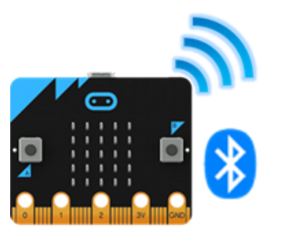

# Arduino, Micro Bit y Raspberry Pi

## 1. Planteamineto del problema

## 2. Objetivos
   - **General**
     - Analizar los componentes, características y plataformas de desarrollo básicas para los dispositivos Arduino, Micro:Bit y Raspberry Pi
   - **Específicos**
     - Identificar los componentes principales de cada dispositivo y determinar sus funciones.
     - Explorar los entornos de desarrollo básicos existentes para cada dispositivo.
     - Explorar los entornos de desarrollo básicos existentes para cada dispositivo.
## 3. Estado del Arte

En lo que respecta a nuestro Producto de Unidad cada una de estas investigaciones tienen su aportación pero estas deberán ser analizadas desde 3 perspectivas distintas

 - Respecto al uso del Arduino en un alimentador canino, nosotros asociamos al producto de unidad él cómo podemos facilitar nuestras actividades diarias con el uso de una simple placa electrónica y la creación de un algoritmo. Esto nos abre más posibilidades en usos facilitandonos las actividades diarias.
 - El micro:bit dentro de nuestro producto de unidad está directamente relacionado en el aprendizaje sobretodo en lo que es programación ya que al ser una plataforma fácil de entender será fácil de usar tanto en niños como en jóvenes como nosotros que estamos empezando a desarrollar habilidades dentro del campo de la informática.
 - En relación del raspberry podemos considerar el uso que se le da con respecto a la computación y al internet de las cosas ya que podemos reducir costos en equipos y espacio con el uso de este pequeño dispositivo ampliando nuestra gama de posibilidades y beneficios.
## 4. Marco Teórico
### Arduino
#### ¿Que es Arduino?
Cuando hablamos de Arduino, hablamos de 3 apartados distintos:
- Una placa de hardware libre: Al hablar de Arduino físicamente hablamos de una placa electrónica multipropósito de libre modificación por parte de sus usuarios, la cual tendrá distintos componentes conectados entre sí. Algunos de sus componentes son cristales, resistencias, capacitores, pines de conexión, etc. Pero el más importante de sus componentes es el microcontrolador, el cual se encargará de realizar los distintos cálculos y de procesar la información recibida para enviar respuestas dependiendo de cómo lo hayamos programado.  Al hablar de hardware libre queremos decir que su modelo o diagramas están abiertas a modificaciones por parte de los usuarios. Arduino a su vez es una placa de Hardware ya que posee componentes electrónicos conectados entre sí. Todos sus componentes electrónicos son controlados mediante un microcontrolador, en Arduino encontraremos los microcontroladores de la familia AVR. (Torrente, 2013)
- Un Software o Entorno de desarrollo libre: Arduino es también el programa que instalamos en nuestra computadora (Windows, MacOS y Linux) donde podemos desarrollar, compilar y cargar nuestro código. (Torrente, 2013)
- Un lenguaje de programación libre: Por ‘’Lenguaje de programación ‘’ nos referimos a un lenguaje artificial diseñado para dar instrucciones a una máquina. Arduino tiene un lenguaje de programación similar a otros lenguajes respecto a sus bloques de control y flujo, pero su sintaxis es mucho más amigable para realizar proyectos de electrónica. (Torrente, 2013)
#### Componentes de un Arduino
Arduino tiene una inmensa gama de modelos lo que hace que definir todos los componentes sea complicado, por lo cual describiremos los componentes existentes en todos los modelos de manera general:

**1. Jack de Potencia:**
Algunos modelos de Arduino cuentan con un Jack de alimentación que nos permite conectar una fuente de alimentación de forma directa, comúnmente este Jack viene en los modelos grandes o más completos.

**2. Conector de comunicación tipo USB:**
Este componente nos permitirá la conexión con el ordenador y también la alimentación del Arduino. Cabe aclarar que existen diferentes tipos de conectores USB por lo que cada modelo de Arduino contará con su propio conector, inclusive algunos modelos de Arduino no lo incluyen, en su mayoría los modelos que no incluyen un conector serial son los modelos pequeños.

**3. Pin Vin:**
Con este pin podemos alimentar nuestro Arduino sin la necesidad de alimentarlo mediante el Jack de potencia o el Conector USB. Este pin viene en todos los modelos de Arduino ya que en modelos pequeños no dispondremos de Jack de potencia o conector USB.

**4. Pin de 5V:**
Este pin nos permite alimentar otros componentes electrónicos que no necesiten de una gran potencia como lo serían algunos sensores. Este pin tiene la finalidad de evitarnos el cableado de alimentación de componentes que estén cerca del Arduino y que trabajan con potencias bajas.

**5. Pin de 3.3V:**
Al igual que el pin de 5V, este pin nos permite alimentar componentes que trabajan con voltajes de referencia bajos evitándose usar fuentes alternas de alimentación.

**6. Pin de GND:**
El pin de GND (Tierra) es común en todos los circuitos electrónicos de corriente continua y nos permite conectar el mismo a otros componentes externos o en caso de usar el pin de alimentación Vin debemos conectar este pin directo al GND de nuestra fuente de alimentación.

**7. Pines Analógicos:**
La placa Arduino puede leer valores de voltaje analógicos siempre y cuando estos no superen los 5V ya que valores superiores de voltaje podrían dañar nuestra placa. Con voltajes analógicos nos referimos a valores de voltaje que no son constantes con respecto al tiempo, es decir valores variables de voltaje. Cabe aclarar que Arduino es capaz únicamente de leer valores de voltaje analógicos, pero no es capaz de enviar señales analógicas. Estos pines están representados en la placa por la letra A.

**8. Pines Digitales:**
Al trabajar con electrónica digital estamos hablando de enviar valores de voltaje de 0V o 5V (0 y 1 lógico). Estos pines pueden ser de entrada y salida es decir pueden enviar y recibir señales digitales. Estos pines van numerados del 0 hasta n, donde n dependerá del modelo de Arduino usado. Los pines de entrada analógica también pueden ser usados como pines digitales.

**9. Pines PWM:**
Primero debemos aclarar que es una señal PWM. Esta es una señal de tipo digital sus siglas traducidas del inglés significan Modulación por Ancho de Pulso (Pulse Width Modulation) una señal digital posee 2 estados lógicos (0 o 1) si en un intervalo de tiempo dado nosotros hacemos que nuestro circuito envié ambas señales de manera repetitiva y constante ya estamos generando una onda cuadrada la cual será una señal PWM. Las aplicaciones de una señal PWM son el envió de información y modificar la cantidad de energía que se envía a una carga.
Con respecto al modificar la cantidad de energía que se envía a una carga esta aplicación de una señal PWM es muy útil cuando trabajamos con leds o motores ya que podemos modificar su intensidad sin necesidad de trabajar con señales analógicas. Esto lo podemos realizar mediante la modificación de sus ciclos de trabajo.

El ciclo de trabajo en una señal PWM se determina en función de la siguiente fórmula:

Donde Ta es el Tiempo en estado alto, T es el periodo de la señal y C es el ciclo de trabajo.
Si a un Led le enviamos una señal PWM con un ciclo de trabajo del %50 su intensidad será del %50 respecto a su máxima, mientras que si enviamos una señal con un ciclo de %0 el diodo estará apagado.
En Arduino tenemos pines que permiten enviar señales de este tipo y están identificados con el siguiente símbolo en su placa ~.

**10.Pin Aref:**
Este pin nos permite tomar valores de voltaje de referencia para sensores analógicos que envíen valores al Arduino mayor a su rango de bit siempre y cuando estén en el rango de 0v a 5v.

**11.Botón Reset, Pin Reset:**
Este botón y pin nos permiten reiniciar nuestro código desde el principio tanto en funciones como en valores es decir vuelve a iniciar el código sin información guardada y comenzando desde su primera línea de código.

**12. LED de alimentación:**
Son 2 leds que nos indican cuando se está transmitiendo información (TX) y recibiendo información (RX) por medio de su puerto de comunicación serial.

**13.Indicador RX y TX:**
Este componente nos permite regular la alimentación que reciba nuestro Arduino de la fuente par que el Arduino tenga 5V limpios de alimentación.

**14.Regulador de Voltaje:**
Este circuito integrado es el encargado de la comunicación en si ya que por medio de este componente pasan todos los datos que enviemos o recibamos del ordenador y los dirige al microcontrolador de nuestro Arduino.

**15.Circuito de comunicación:**
Este componente es el encargado de generar los pulsos de reloj de nuestro Arduino los cuales genera la velocidad de procesamiento.

**16.Cristal:**
Este conector nos permite recibir nuestro código sin necesidad de usar la comunicación USB pero para esto es necesario el uso de programadoras externas.

**17.Conector ICSP:**
Es un led indicador de que nuestro Arduino se encuentra alimentado y operando.

**18.Microcontrolador:**
Este es cerebro de nuestro Arduino el encargado de procesar datos e instrucciones. Este cuenta con:
  - Memoria: SRAM, Flash, EEPROM, ROM, etc.
  - Buses
  - UART
  - Otras comunicaciones.
  - CPU
En otras palabras el microcontrolador es el Arduino ya que los pines del Arduino son jacks que facilitan la conexión con los pines del microcontrolador.
Arduino usa la gama de microcontroladores AVR de Atmel pertenecientes a la familia de microcontroladores RISC. Cada microcontrolador posee diferentes características: tamaños, RAM, ROM, etc. El microcontrolador usado dependerá exclusivamente del modelo de Arduino.

#### Componentes Arduino Uno
Para el modelo Arduino UNO contaremos con los siguientes componentes
 - El microprocesador ATmega328
 - 32 kbytes de memoria Flash (Memoria donde se guardará nuestro programas y datos permanentes)
 - 1 kbyte de memoria RAM (Memoria Temporal o de Datos Volátiles)
 - 16 MHz (Velocidad de trabajo del microcontrolador)
 - 14 pins para entradas/salidas digitales (programables)
 - 5 pins para entradas analógicas (Pueden ser usadas como digitales)
 - 6 pins para salidas analógicas (salidas PWM)
 - Microcontrolador ATmega328
 - Voltaje de operación 5V
 - Voltaje de entrada (recomendado) 7-12 V
 - Voltaje de entrada (limite) 6-20 V
 - DC corriente I/O Pin 40 mA
 - DC corriente 3.3V Pin 50 mA
 - EEPROM 512 bytes (Memoria ROM borrable eléctricamente)
 
#### TinkerCAD
**¿Qué es CAD?**

Cuando hablamos de CAD nos referimos al diseño asistido por computadora traducido de sus siglas en inglés computer-aided design.

**¿Qué es TinkerCAD?**

TinkerCAD es un software desarrollado por AutoDesk para la creación de modelos 3D basado en geometría sólida constructiva (CSG), este software tiene la particularidad que no es necesario ser un gran experto en diseño 3D ya que inclusive niños pueden crear sus modelos a manera de aprendizaje.

**¿Cómo se relaciona TinkerCAD con Arduino?**

TinkerCad tiene un emulador de circuitos electrónicos que viene incluido con un Arduino UNO para emular, incluido un editor de código de Arduino con algunas librerías y un depurador.
Todas estas características hacen que no se no haga tan complicado crear programas y circuitos dentro de este entorno ya que el software es sumamente intuitivo y sencillo de usar. 
Entorno

En la parte derecha contamos con un menú desplegable con distintos componentes electrónicos que nos facilita el software. En la parte izquierda se muestra un recuadro con distintos tutoriales en caso de no tener conocimientos básicos en simuladores de circuitos electrónicos.
En el menú superior contamos con distintos botones funcionales como lo son: el inicio de simulación, depurador, editor de códigos e inclusive contamos con la opción de compartir.
El principio de simulación es sencillo ya que únicamente debemos establecer puntos de conexión mediante las líneas que creamos.

#### Editor de código TinkerCAD
El funcionamiento de este editor de código es similar al software propio de Arduino en caso de que decidamos trabajar con texto ya que su sintaxis de programación es la misma. TinkerCAD cuenta con un generador de códigos mediante bloques el funcionamiento de este es más intuitivo ya que nos evitamos el escribir muchas líneas de código ya que al ser una herramienta visual es más sencillo. El software también nos permite crear un código mezclando bloques y texto.

Ejemplos realizados (revisar el resto de documento para conocer programación y diagramas):
 - Simulación de semáforo
 - Simulación de barrido de diodos
### MicroBit
En el caso específico del microbit necesitamos saber, que es, cuáles son sus características, que tipo de proyectos podemos realizar con él, cuál es su manera de operar. Debemos indagar todos esos aspectos debido a que no se conoce nada sobre la placa en la que se va a trabajar.
**¿Qué es MicroBit?**

MicroBit es una tarjeta de circuitos del tamaño de la palma de una mano con una serie de 25 ledes y un chip Bluetooth para conexión inalámbrica. Puede ser programada para mostrar letras, números y otros símbolos y caracteres.
Micro Bit fue diseñada para alentar a los niños a participar activamente en la creación de software para computadoras y la creación de nuevas cosas, en lugar de ser consumidores de medios. Creada para funcionar junto con otros sistemas, como Raspberry Pi

**¿Cuáles son las características de MicroBit?**
 - Incluye dos botones, un acelerómetro y una brújula, y unos anillos a los cuales pueden ser conectados otros sensores.
 - En lugar de introducir el código directamente en la computadora, los usuarios deben escribirlo en una elección de cuatro lenguajes de programación basados en una PC, o en una tableta o teléfono inteligente, a través de una aplicación.
 - Después deben transferir los códigos a Micro Bit, que funciona como un dispositivo independiente que puede ser usado para proyectar mensajes y registrar movimientos, entre otras tareas.
 - También puede agregarse a otros dispositivos para formar el “cerebro” de un robot o desarrollar un instrumento musical.
 - Una nueva función posibilita las comunicaciones entre esas máquinas, lo cual significa que una Micro Bit pueda transmitir información a otra, abriendo un nuevo espectro de posibilidades.

**Componentes de MicroBit**
 - **Leds:**
 Microbit dispone de 25 LEDs programables individualmente que te permiten mostrar texto, números e imágenes.
 
 
 
 - **Botones:**
 Hay dos botones en la cara frontal de micro:bit (etiquetados como A y B). Puedes detectar cuándo son pulsados de forma independiente o a la vez y ejecutar una acción en cada caso.
 
 
 
 - **Pines de entrada y salida:**
 Microbit es ampliable hasta donde imagines. Dispone de 25 conectores situados en el borde inferior . A través de ellos podrás programar motores, LEDs o cualquier otro componente o sensor externo que conectes de Arduino o similares.
 
 
 
 - **Sensor de luz:**
 Los LEDs de la placa micro:bit también pueden actuar como entrada haciendo que detecten la luz ambiente.
 
 
 
 - **Sensor de temperatura:**
 El sensor de temperatura integrado en la placa detecta la temperatura ambiente en grados Celsius.
 
  
 
 - **Acelerómetro:**
El acelerómetro mide la aceleración de tu micro:bit. Se activa cuando tu placa se mueve y también puede detectar otras acciones como agitar, girar y hasta soltar tu micro:bit en caída libre!

- **Brujula:**
La brújula detecta el campo magnético terrestre por lo que puedes saber en qué dirección está orientada tu micro:bit. (Necesita ser calibrada para asegurar un resultado preciso.)

- **Radio:**
La radio te permite comunicar tu micro:bit con otras micro:bit. Por ejemplo, puedes conectar todas las tarjetas dentro de un aula a una misma emisora, usarla para enviar mensajes entre ellas y mucho más!.

- **Bluetooth:**
El BLE (Bluetooth Low Energy) permite a micro:bit enviar y recibir datos vía bluetooth para comunicarse de forma inalámbrica con PCs, Teléfonos y Tablets.

- **USB y conector para batería externa:**
La placa micro:bit puede alimentarse a través del puerto USB. También dispone de un conector específico para 2 pilas AAA o una batería.
Al igual que en Arduino, esta placa almacena en su memoria un único programa que se ejecuta en cuanto recibe alimentación (ya que carece de un conmutador de encendido y apagado).

#### Plataforma de trabajo de MicroBit
Esta pequeña tarjeta va de la mano con la pagina creada por sus desarrolladores, ya que están podemos encontrar herramientas de programación debido a que esta tarjeta tiene un entorno de programación gráfico propio la pagina posee el apartado MakeCode de Microsoft, un sencillo editor gráfico online muy potente y gratuito que posibilita introducirnos en el mundo de la programación de forma intuitiva a través del lenguaje de programación visual o de bloques. Con él aprendemos a pensar como un programador sin caer en los molestos errores de sintaxis. MakeCode es, sin duda, una herramienta a tener muy en cuenta por nuestros profesores.
BBC MicroBit también se puede programar con JavaScript, Pyton y Scratch (añadiendo una extensión).

